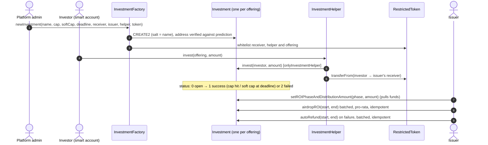

# Private Placement Escrow

Smart contracts for **tokenized private placements**: a factory that deploys one isolated offering contract per deal, with a hard cap, a soft cap and a deadline; subscriptions through a helper that settles straight to the issuer; phased, pro-rata distribution of returns; and refunds when a raise fails. A KYC-gated **restricted token** is used for settlement, distributions and refunds, so only whitelisted accounts can ever hold or move value.

This is a white-label build of contracts I wrote for a private-markets platform, where accredited investors fund tokenized offerings from $5,000 a ticket through gasless smart accounts.

---

## How it works



| Contract | Responsibility |
|---|---|
| **InvestmentFactory** | Deploys offerings with **CREATE2** (salt = offering name), checks the deployed address against `computeEscrowAddress`, and whitelists the new offering, helper and receiver on the token. |
| **Investment** | One offering. Hard cap, soft cap and deadline drive a three-state status machine. Records subscriptions, distributes each return phase pro-rata in operator-sized batches, and refunds failed raises. |
| **InvestmentHelper** | The only entry point for subscriptions: records the subscription, then moves the settlement token from investor to issuer (non-reentrant). |
| **RestrictedToken** | ERC-20 where non-admin holders can only send **to** admins (issuer receivers, offerings, the helper). Value can't leak to un-KYC'd wallets. Mintable by the owner; admins managed by the owner or the factory. |

---

## Audit: bugs found and fixed

While writing tests for this showcase I audited the original contracts. Each fix has a regression test that runs the same scenario against the original ([`test/legacy/InvestmentV1.sol`](test/legacy/InvestmentV1.sol)) and the fixed contract.

| # | Severity | Bug | Fix | Test |
|---|---|---|---|---|
| 1 | 🔴 Critical | `onlyInvestmentHelper` was written as `msg.sender == investmentHelper;` with no `require`, so it **never reverted**. Anyone could call `Investment.invest(self, x)` directly, record a subscription **without paying**, take a pro-rata share of every return distribution (or a refund), and fill the cap to close the raise to real investors. | `if (msg.sender != investmentHelper) revert Investment__NotHelper();` | `test_bug1_freeSubscriptionStealsReturns` |
| 2 | 🟠 High | Shares were divided by the **hard cap** instead of the amount actually raised. A raise closing at its soft cap (say 80%) distributed only 80% of every phase, leaving the rest stranded in the contract. | Divide by `totalInvested` | `test_bug2_underDistributionBelowHardCap` |
| 3 | 🟠 High | Batched `airdropROI` / `autoRefund` kept no record of who had been paid. Retrying a batch (after an RPC timeout, say) **paid the same investors twice** out of everyone else's share. | Per-phase `roiPaid` and per-investor `refunded` flags; batches are idempotent | `test_bug3_retriedBatchPaysTwice`, `test_airdropIsIdempotent`, `test_refundsOnFailedRaiseAreIdempotent` |
| 4 | 🟡 Low | Out-of-range batch bounds panicked; token transfers didn't use SafeERC20. | `Investment__InvalidRange`; `SafeERC20` throughout | `test_airdrop_guards` |

### Design notes

- Subscriptions settle **directly to the issuer's receiver** rather than sitting in escrow. Refunds on a failed raise are therefore funded by the issuer into the offering contract, then paid out by `autoRefund`. That's a trust assumption on the issuer, enforced off-chain by the platform.
- The owner can withdraw any token held by an offering (`withdrawAccidentalTokens`), including an unpaid distribution. That's useful for operations, but it's an admin power to put behind a multisig.

---

## Tests

```bash
git clone --recurse-submodules https://github.com/yasinadil/private-placement-escrow
cd private-placement-escrow
forge test
forge coverage --no-match-coverage "(test|script)"
```

**22 tests:** unit, regression and fuzz. The fuzz test checks that payouts conserve each phase to within 1 wei of rounding per investor.

| Contract | Lines | Functions |
|---|---|---|
| Investment | 100% | 100% |
| InvestmentHelper | 100% | 100% |
| RestrictedToken | 100% | 100% |
| InvestmentFactory | 93.8% | 100% |
| **Total** | **99.2%** | **100%** |

## Deploying

```bash
DEPLOYER=0x... ADMIN=0x... forge script script/Deploy.s.sol --rpc-url $BASE_RPC_URL --account deployer --broadcast
```

## Stack

Solidity 0.8.28 · Foundry · OpenZeppelin 5.2 (ERC20, Ownable, ReentrancyGuard, SafeERC20) · CREATE2 · Base
